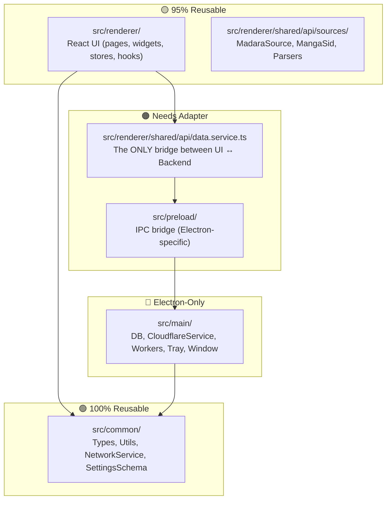
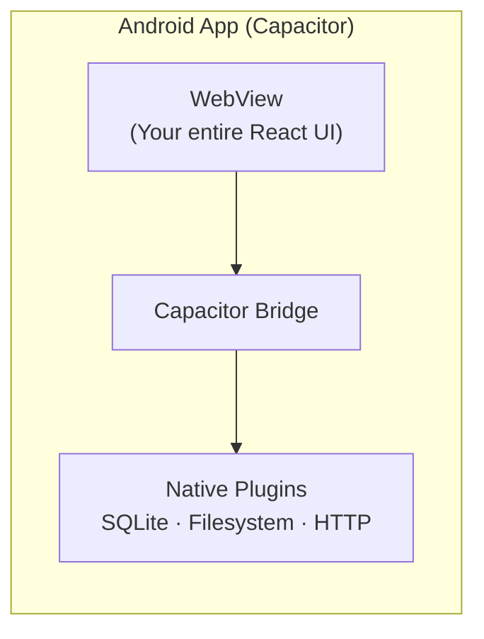

# AutaKimi for Android — Strategy & Reuse Analysis

## Your Current Architecture

Your Electron app has a clean 4-layer architecture:



> [!TIP]
> **The key insight**: Your entire UI talks to the backend through a **single file** — `data.service.ts`. This is an excellent abstraction boundary. The Android strategy reduces to: **"How do we re-implement what's behind `DataService`?"**

---

## Layer-by-Layer Reuse Analysis

| Layer | Files | Reusable? | Notes |
|-------|-------|-----------|-------|
| `src/common/` | Types, utils, network config, settings schema | ✅ **100%** | Zero Electron dependencies |
| `src/renderer/shared/model/` | Zustand stores (UI, library, reader, settings, etc.) | ✅ **100%** | Pure React state management |
| `src/renderer/shared/api/sources/` | MadaraSource, MangaSid, parsers, resolvers | ✅ **100%** | Pure JS/TS, uses `cheerio` & `fetch` |
| `src/renderer/shared/ui/` | Toast, Sheet, Select, Button components | ✅ **100%** | Tailwind + React (works in WebView) |
| `src/renderer/pages/` | All 8 pages (browse, library, reader, etc.) | ✅ **100%** | Pure React components |
| `src/renderer/widgets/` | Reader, details, download queue, etc. | ✅ **~95%** | Minor touch gesture adaptations needed |
| `src/renderer/shared/api/data.service.ts` | The IPC bridge | 🔁 **Swap** | Replace `window.api` with a native bridge |
| `src/preload/` | Electron contextBridge | ❌ **Skip** | Replaced by mobile bridge |
| `src/main/db/` | SQLite via better-sqlite3 + Drizzle | 🔁 **Swap DB driver** | Same schema, different SQLite driver |
| `src/main/services/cloudflare.service.ts` | BrowserWindow-based CF bypass | ❌ **N/A** | Android uses WebView-based approach |
| `src/main/services/extension.service.ts` | Worker thread sandbox | 🔁 **Swap** | Use WebView JS eval or V8 isolate |
| `src/main/tray.ts`, window management | System tray, window controls | ❌ **Skip** | Desktop-only features |

---

## The Three Options

### Option A: **Capacitor** (Recommended — Fastest Path)

> [!IMPORTANT]
> **Reuse: ~90% of your codebase unchanged.** Your React app runs in a native Android WebView with Capacitor plugins providing native access (SQLite, filesystem, notifications).



**What changes:**
- `data.service.ts` → swap `window.api.*` calls with Capacitor plugin calls
- `better-sqlite3` → `@capacitor-community/sqlite`
- CF bypass → Android WebView cookie sharing (actually easier than Electron)
- Extension sandbox → `eval()` in the WebView context (simpler)

**What stays identical:**
- Every React component, page, widget, hook and store
- All source parsers (MadaraSource, MangaSid, etc.)  
- All types, utils, and common code
- Tailwind CSS styling

**Monorepo structure:**
```
AutaKimi/
├── src/
│   ├── common/          # Shared (unchanged)
│   ├── main/            # Electron backend (unchanged)
│   ├── preload/         # Electron bridge (unchanged)
│   └── renderer/        # React UI (unchanged)
├── android/             # NEW — Capacitor Android project
├── capacitor.config.ts  # NEW — Capacitor config
├── src/mobile/          # NEW — Mobile-specific adapters
│   ├── data.service.mobile.ts   # Capacitor version of DataService
│   ├── db.mobile.ts             # SQLite via Capacitor plugin
│   └── cf.mobile.ts             # WebView-based CF bypass
├── package.json         # Add capacitor deps
└── vite.config.mobile.ts  # NEW — Mobile build config
```

**Effort estimate:** ~2-3 weeks for a working prototype

---

### Option B: **React Native + Expo**

**Reuse: ~40-50%.** Business logic and state management reuse well, but **every UI component must be rewritten** with React Native primitives (`<View>`, `<Text>`, `<ScrollView>` instead of `<div>`, `<p>`, etc.).

| Reusable | Must Rewrite |
|----------|-------------|
| Zustand stores | All JSX (no HTML elements) |
| Source parsers | All CSS/Tailwind → StyleSheet |
| Types & utils | Navigation (react-router → react-navigation) |
| Settings schema | Every UI component |

**Effort estimate:** ~2-3 months

---

### Option C: **Kotlin Native (Jetpack Compose)**

**Reuse: ~10-15%.** Only the source parsing logic can be ported (and even that needs translation to Kotlin). This is essentially building a new app from scratch.

**Effort estimate:** ~4-6 months

---

## Recommendation: Capacitor

> [!IMPORTANT]
> Capacitor is the clear winner for your situation because:
> 1. Your UI is **already web-based** (React + Tailwind + Vite)
> 2. You have a **single abstraction point** (`DataService`) that makes the swap trivial
> 3. You get **native Android APK** distribution with minimal changes
> 4. The same codebase serves both desktop and mobile

### What Would the Migration Look Like?

**Phase 1 — Setup (1 day)**
- Add Capacitor to the project
- Create `android/` native project  
- Configure Vite to output a static build for Capacitor

**Phase 2 — DataService Adapter (3-5 days)**
- Create `data.service.mobile.ts` using Capacitor's native HTTP, SQLite, and Filesystem plugins
- Conditional import: desktop uses `window.api`, mobile uses Capacitor plugins
- Port database schema (same SQL, different driver)

**Phase 3 — Mobile Adaptations (1-2 weeks)**
- Touch-optimized gestures for the manga reader
- Mobile navigation (bottom tabs instead of sidebar)
- Status bar, safe areas, back button handling
- Remove desktop-only features (tray, window controls, title bar)

**Phase 4 — CF Bypass on Android (2-3 days)**
- Use Android WebView to solve Cloudflare challenges
- Share cookies between WebView and HTTP client

---

## Open Questions

Before proceeding, I need your input on:

1. **Which approach do you prefer?** Capacitor (fast, max reuse) vs React Native (native feel, more work)?
2. **Mobile-specific features?** Should the Android app have feature parity, or a simpler subset?  
3. **Distribution?** Google Play Store, APK sideload, or both?
4. **Priority?** Should we start this now, or finish stabilizing the desktop app first?
