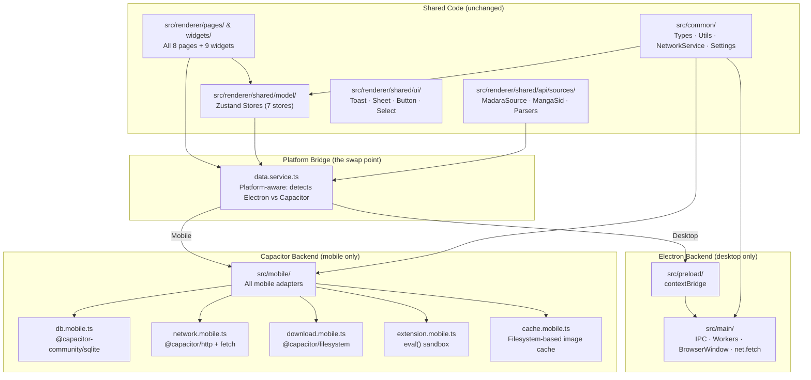

# AutaKimi Android — Capacitor Implementation Plan

## Goal

Port AutaKimi to Android within the same monorepo using Capacitor, reusing ~90% of the existing React codebase. The Android app will be a native APK wrapping the existing renderer in a WebView, with Capacitor plugins replacing every Electron-specific backend service.

---

## Architecture Overview



---

## User Review Required

> [!IMPORTANT]
> **Breaking Change: Monorepo Structure**
> This plan adds a `src/mobile/` directory and an `android/` directory to the repo. The existing Electron build pipeline is **completely untouched**. The mobile build uses a separate `vite.config.mobile.ts`.

> [!WARNING]
> **Cloudflare Bypass on Android**
> Android WebView-based CF bypass is inherently different from Electron's `BrowserWindow`. The user may need to manually solve a CAPTCHA in an in-app browser. This is the same approach used by Tachiyomi/Mihon.

> [!IMPORTANT]
> **Database Strategy Decision**
> Two options for the mobile SQLite driver:
> 1. **`@capacitor-community/sqlite`** — Mature, async API, supports migrations. Recommended.
> 2. **`sql.js`** (WASM SQLite in WebView) — No native plugin needed, but slower on large datasets.
>
> **Recommendation**: Option 1 (`@capacitor-community/sqlite`).

---

## Proposed Changes

### Phase 1: Project Scaffolding (Day 1)

#### [NEW] `capacitor.config.ts`
The Capacitor configuration file. Points to the Vite build output directory.

```ts
import type { CapacitorConfig } from '@capacitor/cli'

const config: CapacitorConfig = {
  appId: 'com.anasx07.autakimi',
  appName: 'AutaKimi',
  webDir: 'dist-mobile',        // Output of vite.config.mobile.ts
  android: {
    allowMixedContent: true,     // Needed for manga image loading from HTTP sources
    webContentsDebuggingEnabled: true // Dev only
  },
  plugins: {
    CapacitorSQLite: {
      iosDatabaseLocation: 'Library/CapacitorDatabase'
    },
    CapacitorHttp: {
      enabled: true
    }
  }
}

export default config
```

#### [NEW] `vite.config.mobile.ts`
A standalone Vite config (not electron-vite) that builds the renderer as a standard SPA for Capacitor.

- Uses the **same `src/renderer/`** source files
- Same path aliases (`@renderer`, `@common`)
- Outputs to `dist-mobile/`
- Does NOT include electron-specific plugins or bytecode compilation

#### [NEW] `android/` directory
Auto-generated by `npx cap add android`. Contains the Android Studio project, Gradle configs, and AndroidManifest.xml.

#### [MODIFY] `package.json`
Add new scripts and dependencies:

```json
{
  "scripts": {
    "dev:mobile": "vite --config vite.config.mobile.ts",
    "build:mobile": "vite build --config vite.config.mobile.ts",
    "cap:sync": "npx cap sync android",
    "cap:open": "npx cap open android",
    "cap:run": "npx cap run android"
  },
  "dependencies": {
    "@capacitor/core": "^7.x",
    "@capacitor/app": "^7.x",
    "@capacitor/filesystem": "^7.x",
    "@capacitor/haptics": "^7.x",
    "@capacitor/status-bar": "^7.x",
    "@capacitor-community/sqlite": "^7.x"
  },
  "devDependencies": {
    "@capacitor/cli": "^7.x"
  }
}
```

---

### Phase 2: Platform Detection & DataService Swap (Days 2-4)

This is the **critical** phase. The entire UI talks to the backend through one file — [data.service.ts](file:///d:/DEV/Apps/AutaKimi/src/renderer/src/shared/api/data.service.ts). We make it platform-aware.

#### [NEW] `src/shared/platform.ts`
A tiny utility that detects the runtime:

```ts
export const isMobile = (): boolean => {
  return typeof (window as any).Capacitor !== 'undefined'
}
export const isDesktop = (): boolean => !isMobile()
```

#### [MODIFY] [data.service.ts](file:///d:/DEV/Apps/AutaKimi/src/renderer/src/shared/api/data.service.ts)
Make the DataService conditionally import the Electron or Capacitor backend:

**Current** (line 5):
```ts
const getApi = () => (window as any).api as ElectronApi
```

**New strategy**:
```ts
import { isMobile } from '@renderer/shared/platform'
import { MobileApi } from '@mobile/api'

const getApi = () => {
  if (isMobile()) return MobileApi
  return (window as any).api as ElectronApi
}
```

The `MobileApi` object implements the same `ElectronApi` interface, so every `callIpc()` call works identically. This is a **drop-in replacement** — zero changes needed in any store, page, or widget.

---

### Phase 3: Mobile Backend Implementation (Days 5-12)

All new files live in `src/mobile/`. Each one replaces a specific Electron main-process service.

#### [NEW] `src/mobile/api.ts`
The master `MobileApi` object that implements the `ElectronApi` interface using Capacitor plugins:

```ts
export const MobileApi: ElectronApi = {
  db: MobileDB,
  fetchRepo: MobileNetwork.fetchRepo,
  fetchText: MobileNetwork.fetchText,
  executeExtension: MobileExtension.execute,
  installExtension: MobileExtension.install,
  download: MobileDownload,
  // ... etc
}
```

---

#### [NEW] `src/mobile/db.mobile.ts` — Database Layer

**Replaces**: `src/main/db/` (better-sqlite3 + Drizzle)

| Desktop | Mobile |
|---------|--------|
| `better-sqlite3` (Node.js native) | `@capacitor-community/sqlite` (native Android) |
| Sync API | Async API |
| Drizzle ORM | Raw SQL (same schema) |

- Reuses the **exact same SQL migration scripts** from [src/main/db/index.ts](file:///d:/DEV/Apps/AutaKimi/src/main/db/index.ts) (lines 39-255)
- Implements the same repository methods (getExtensions, getLibrary, etc.)
- Same table structure, same column names

---

#### [NEW] `src/mobile/network.mobile.ts` — Network Layer

**Replaces**: `src/main/ipc/network.ts` + Electron's `net.fetch`

- Uses standard `fetch()` API (Android WebView supports it natively)
- For CF-protected sites: uses `@capacitor/browser` to open an in-app browser for the user to solve the challenge, then extracts cookies
- Shares cookies between WebView and fetch via `document.cookie`

---

#### [NEW] `src/mobile/extension.mobile.ts` — Extension Sandbox

**Replaces**: `src/main/extension-worker.ts` + Worker threads

On desktop, extensions run in isolated Node.js Worker threads. On mobile:
- Extensions are evaluated using a sandboxed `Function()` constructor
- Cheerio works in the browser natively (it's pure JS)
- The `fetchText` calls go through `MobileNetwork` instead of `WORKER_FETCH` IPC

This is actually **simpler** than the desktop approach because there's no IPC serialization boundary.

---

#### [NEW] `src/mobile/download.mobile.ts` — Download Manager

**Replaces**: `src/main/services/download.service.ts`

- Uses `@capacitor/filesystem` to write images to the device
- Uses `fetch()` to download page images
- Emits progress events via a simple EventEmitter pattern
- Stores download metadata in the same SQLite tables

---

#### [NEW] `src/mobile/cache.mobile.ts` — Cache Service

**Replaces**: `src/main/services/cache.service.ts` + `DiskCache`

- Image caching via `@capacitor/filesystem` (write to app cache directory)
- Same TTL logic from [cache.service.ts](file:///d:/DEV/Apps/AutaKimi/src/main/services/cache.service.ts) (lines 23-28)
- Manga metadata caching in SQLite (same as desktop)

---

### Phase 4: Mobile UI Adaptations (Days 13-17)

The React UI runs unchanged in the WebView, but needs mobile-specific adjustments.

#### [MODIFY] [AppLayout.tsx](file:///d:/DEV/Apps/AutaKimi/src/renderer/src/app/layouts/AppLayout.tsx)
Make the layout responsive for mobile:

- **Desktop**: Keep `<Sidebar>` + `<TitleBar>` (line 32-34)
- **Mobile**: Replace sidebar with a **bottom tab bar**, hide TitleBar

```tsx
{isMobile() ? <MobileBottomNav /> : <Sidebar />}
{isDesktop() && <TitleBar />}
```

#### [NEW] `src/renderer/src/app/components/MobileBottomNav.tsx`
A bottom navigation bar for mobile with 5 tabs: Library, Browse, Downloads, History, Settings. Uses the same icons from `lucide-react`.

#### [MODIFY] [index.html](file:///d:/DEV/Apps/AutaKimi/src/renderer/index.html)
Add mobile viewport meta tags:

```html
<meta name="viewport" content="viewport-fit=cover, width=device-width, initial-scale=1.0, minimum-scale=1.0, maximum-scale=1.0, user-scalable=no" />
<meta name="format-detection" content="telephone=no" />
<meta name="color-scheme" content="light dark" />
```

#### Mobile-Specific Tweaks (no new files, just conditional logic):

| Area | Desktop Behavior | Mobile Adaptation |
|------|-----------------|-------------------|
| **Reader gestures** | Mouse/keyboard scroll | Touch swipe, pinch-to-zoom |
| **Title Bar** | Custom Electron frameless window | Hidden (uses status bar) |
| **Auto-updater** | electron-updater | Disabled (Play Store handles it) |
| **System tray** | Electron tray icon | Disabled |
| **Window controls** | Min/Max/Close buttons | Android back button |
| **Context menus** | Right-click | Long press |
| **Safe areas** | Not needed | CSS `env(safe-area-inset-*)` |

---

### Phase 5: Android-Specific Features (Days 18-20)

#### [NEW] `src/mobile/cf.mobile.ts` — Cloudflare Bypass
Uses the Capacitor Browser plugin to open a full-screen in-app browser:
1. User sees the CF challenge page
2. User solves it manually (tap checkbox)
3. Plugin extracts `cf_clearance` cookie from the WebView
4. Cookie is stored and used for subsequent `fetch()` calls
5. Same approach as Tachiyomi/Mihon — proven pattern on Android

#### [MODIFY] `android/app/src/main/AndroidManifest.xml`
- Add `INTERNET` permission
- Add `WRITE_EXTERNAL_STORAGE` for downloads
- Set `usesCleartextTraffic=true` for HTTP manga sources

#### [NEW] Status bar & navigation bar styling
Use `@capacitor/status-bar` to match the app theme:
```ts
StatusBar.setBackgroundColor({ color: '#09090b' })
StatusBar.setStyle({ style: Style.Dark })
```

---

## Final Monorepo Structure

```
AutaKimi/
├── android/                          # [NEW] Capacitor Android project
│   ├── app/
│   │   ├── src/main/
│   │   │   ├── AndroidManifest.xml
│   │   │   └── java/.../MainActivity.java
│   │   └── build.gradle
│   └── build.gradle
├── src/
│   ├── common/                       # [UNCHANGED] Types, utils, settings
│   ├── main/                         # [UNCHANGED] Electron backend
│   ├── preload/                      # [UNCHANGED] Electron bridge
│   ├── renderer/                     # [UNCHANGED*] React UI
│   │   ├── src/
│   │   │   ├── app/
│   │   │   │   ├── layouts/
│   │   │   │   │   └── AppLayout.tsx        # [MODIFY] Responsive sidebar/bottom nav
│   │   │   │   └── components/
│   │   │   │       └── MobileBottomNav.tsx   # [NEW] Bottom tab bar
│   │   │   ├── shared/
│   │   │   │   ├── api/
│   │   │   │   │   └── data.service.ts      # [MODIFY] Platform-aware API bridge
│   │   │   │   └── platform.ts              # [NEW] isMobile()/isDesktop()
│   │   │   └── ... (pages, widgets, stores — ALL UNCHANGED)
│   │   └── index.html                       # [MODIFY] Add mobile viewport
│   └── mobile/                       # [NEW] All Capacitor backend adapters
│       ├── api.ts                           # MobileApi entry point
│       ├── db.mobile.ts                     # SQLite via Capacitor plugin
│       ├── network.mobile.ts                # fetch + CF bypass
│       ├── extension.mobile.ts              # JS sandbox via eval
│       ├── download.mobile.ts               # Filesystem downloads
│       ├── cache.mobile.ts                  # Image cache
│       └── cf.mobile.ts                     # CF challenge helper
├── capacitor.config.ts               # [NEW] Capacitor project config
├── vite.config.mobile.ts             # [NEW] Mobile Vite build config
├── electron.vite.config.ts           # [UNCHANGED] Desktop build config
├── package.json                      # [MODIFY] Add Capacitor deps + scripts
└── tsconfig.json                     # [MODIFY] Add mobile path alias
```

---

## Open Questions

> [!IMPORTANT]
> **1. Minimum Android Version?**
> Capacitor 7 supports Android 6.0+ (API 23). Is this acceptable, or do you need to support older devices?

> [!IMPORTANT]
> **2. Play Store vs Sideload?**
> If targeting Play Store, we need to handle content policies (some manga sources may violate them). Sideload-only (APK/GitHub Releases) gives freedom but no auto-updates.

> [!IMPORTANT]
> **3. Offline-First Priority?**
> Should the mobile app work fully offline with downloaded chapters, or is online-first acceptable for v1?

---

## Verification Plan

### Automated Tests
1. `npm run build:mobile` — Verify Vite produces a valid SPA in `dist-mobile/`
2. `npx cap sync android` — Verify Capacitor copies assets to the Android project
3. Type-check: `tsc --noEmit -p tsconfig.mobile.json` — Verify no TS errors in mobile code

### Manual Verification
1. **Android Emulator**: Launch via `npx cap run android`, verify all 8 pages render
2. **Browse Page**: Install a Madara extension, verify manga list populates
3. **Reader**: Open a chapter, verify touch gestures work
4. **Downloads**: Download a chapter, verify it saves to filesystem
5. **CF Bypass**: Test a CF-protected source (Mangalek), verify in-app browser flow works
6. **Desktop Regression**: Run `npm run dev` — verify Electron desktop app is completely unaffected

### Build Pipeline
```bash
# Desktop (unchanged)
npm run build:win

# Mobile (new)
npm run build:mobile && npx cap sync android
# Then open in Android Studio: npx cap open android
# Build APK from Android Studio
```
